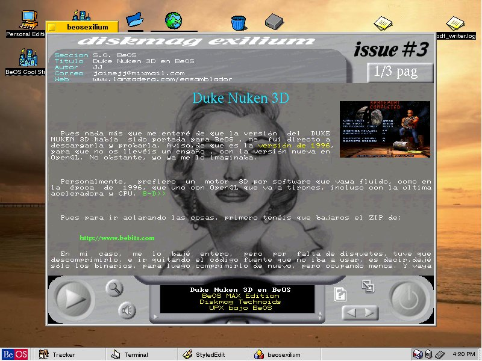
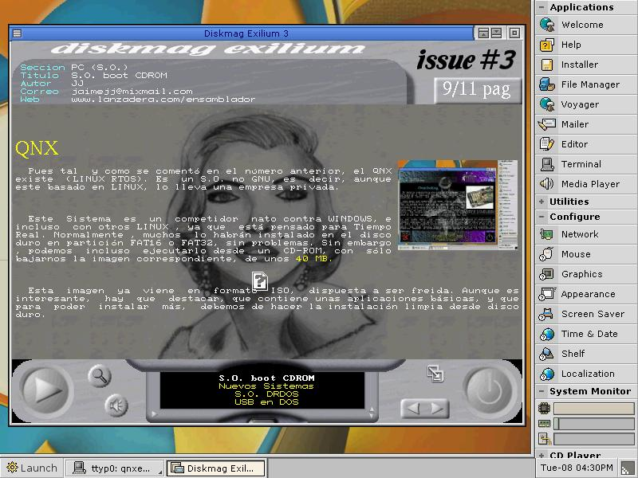

# Diskmag Exilium 3 (January 2005)

Around January 2005, our <b>Sliders</b> group published Diskmag Exilium issue 3 on our own FTP. 
Subsequently, several members of the demoscene published it on <b>pouet.net</b> and <b>scene.org</b>.

<ul>
 <li><a href='https://www.pouet.net/prod.php?which=15221'>https://www.pouet.net/prod.php?which=15221</a></li>  
 <li><a href='https://files.scene.org/view/mags/exilium/exiliumwin32-3.zip'>https://files.scene.org/view/mags/exilium/exiliumwin32-3.zip</a></li>
</ul>  

Articles to be highlighted:
<ul>
 <li>Interview to Codepixel, derethor (Javier Loureiro) of the group Centolos and Solstice</li>
 <li>BeOS's defunct Technoid magazine</li>
 <li>Diskmag Hugi 24</li>
 <li>Diskmag Pain 1001</li>
 <li>Diskmag ONLINE extinct CPC OXYGEN</li>
 <li>Programming in DX-CREATOR</li>
 <li>Use of PTTSound in hamradio</li>
</ul>

This diskmag was multiplatform (DOS, Windows, Linux, Beos and QNX). It had several other engines, like BSD and PSX, but in the end, it was released for those 5. 
The editor and coder of it is me (JJ, ackerman). 

After so many years, I am releasing the code, so that it can be looked at in an educational way or whatever you want, given that it is of little use today. 

If you only want to run, the data (sliders3.dat) was in the MSDOS distribution, having to copy the binaries for each OS to the same location. 

In issue 2 of Centolos'Becanne magazine we have an article dedicated to us:
En el número 2 de la revista Becanne de Centolos nos dedican un artículo:

