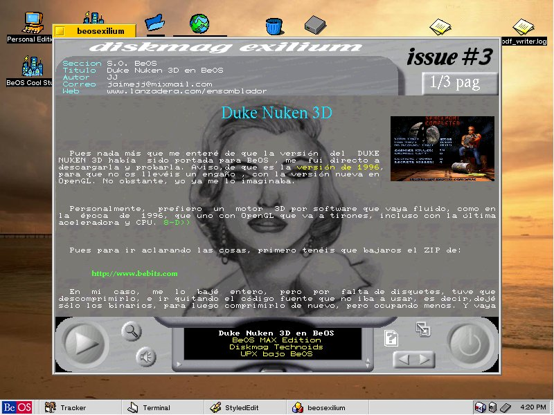
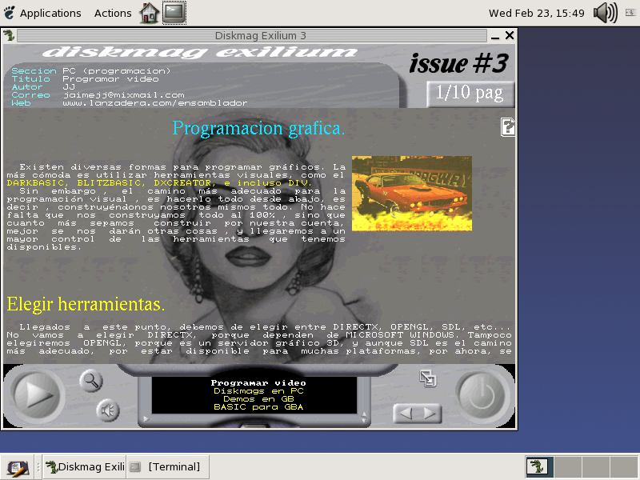
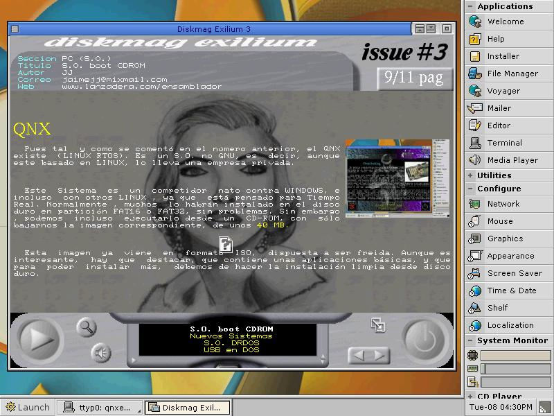

# Diskmag Exilium 3 (Enero 2005)

Aproximádamente, en Enero del 2005 nuestro grupo <b>Sliders</b> publicó el número 3 de la Diskmag Exilium en nuestro propio FTP. 
Posteriormente, varios miembros de la demoscene, lo publicaron en <b>pouet.net</b> y <b>scene.org</b>.

<ul>
 <li><a href='https://www.pouet.net/prod.php?which=15221'>https://www.pouet.net/prod.php?which=15221</a></li>  
 <li><a href='https://files.scene.org/view/mags/exilium/exiliumwin32-3.zip'>https://files.scene.org/view/mags/exilium/exiliumwin32-3.zip</a></li>
</ul>  

Artículos a destacar:
<ul>
 <li>Entrevista a Codepixel, derethor(Javier Loureiro) del grupo Centolos y Solstice</li>
 <li>Revista extinta Technoid de BeOS</li>
 <li>Diskmag ONLINE extinta CPC OXYGEN</li>
 <li>Programar en DX-CREATOR</li>
 <li>Uso del PTTSound en hamradio</li>
</ul>

Dicha diskmag fue multiplataforma (DOS, Windows, Linux, Beos y QNX). Tenía varios motores más, como BSD y PSX, pero al final, salió para esos 5. 
El editor y coder de la misma soy yo (JJ, ackerman). 

Después de tantos años, libero el código, para que se mire de manera educativa o lo que se quiera, dado que a día actual, tiene muy poca utilidad. 

Si sólo se quiere ejecutar, los datos (sliders3.dat) estaban en la distribución de MSDOS, teniendo que copiar los binarios de cada Sistema Operativo en su misma ubicación.
